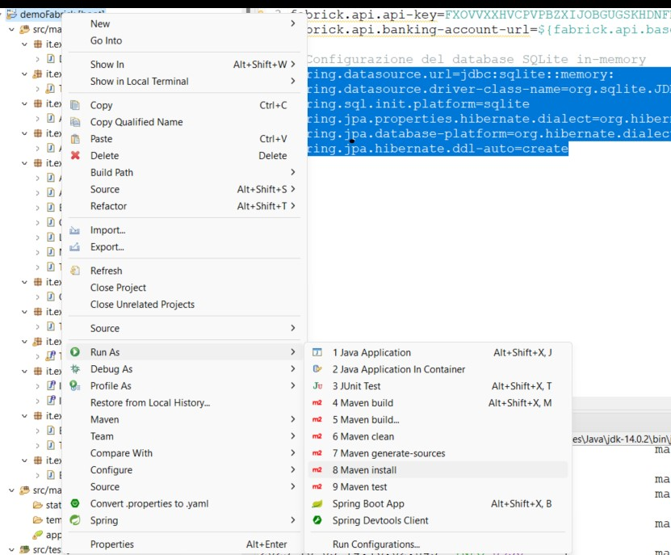

# DemoFabrick App

## Descrizione
- Questa è un'app di esempio che fornisce un'interfaccia API per effettuare operazioni su account bancari utilizzando il servizio Fabrick.

### JavaDoc
- presenti nella cartella javadoc
### Tecnologie Utilizzate e da installare
- `git` scaricabile da [qui](https://git-scm.com/downloads)
- `Java 14` scaricabile da [qui](https://jdk.java.net/21/)
- `Maven`  scaricabile da [qui](https://maven.apache.org/download.cgi)
- `Sts ` scaricabile da [qui](https://spring.io/tools)

### Setup del Progetto
#### Clona il repository. 
```
git clone https://github.com/AulicinoDiego/demoFabrick.git
```

#### Configura le proprietà del servizio Fabrick nel file application.properties.
```
fabrick.api.base-url=https://xxxxxxxx
fabrick.api.api-key=XXXXXXXXXXXXXXXXXX
fabrick.api.banking-account-url=${fabrick.api.base-url}/api/gbs/banking/v4.0/accounts
```

#### Configura le proprietà del db sqlite nel file application.properties.
```
spring.datasource.url=jdbc:sqlite::memory:
spring.datasource.driver-class-name=org.sqlite.JDBC
spring.sql.init.platform=sqlite
spring.jpa.properties.hibernate.dialect=org.hibernate.dialect.SQLiteDialect
spring.jpa.database-platform=org.hibernate.dialect.SQLiteDialect
spring.jpa.hibernate.ddl-auto=create
```
#### Esegui l'applicazione utilizzando l'IDE "STS"



 #### Esegui l'applicazione da riga di comando:

- clean e buildare il progetto:
```
mvn clean install
```
- run del progetto:
```
mvn spring-boot:run
```
